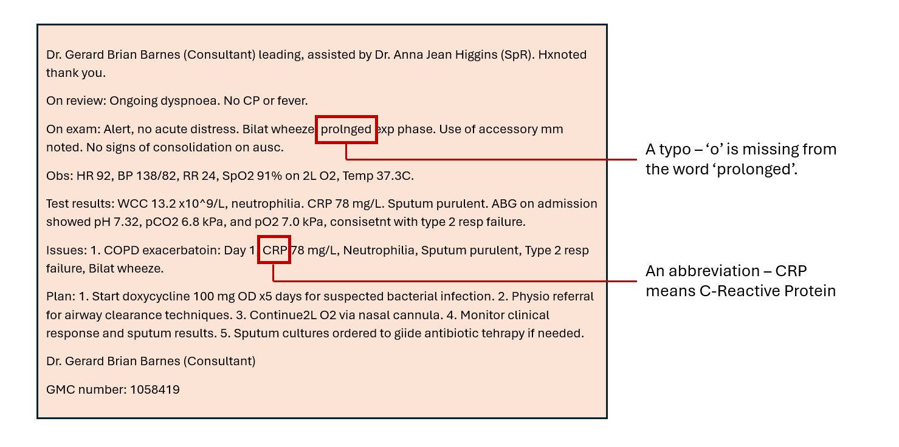

> Yes it can – and it can do a remarkably good job!
>
> This article explores our recent work creating synthetic patient pathways, with corresponding clinical notes at every step of the journey. Developed alongside clinicians, these notes could help the development of the next generation of healthcare AI tools. Our full pipeline is available on [GitHub](https://github.com/nhsengland/synthetic_clinical_notes).

<!-- more -->

## Why do we need synthetic clinical notes?

[Over 800,000](https://digital.nhs.uk/data-and-information/publications/statistical/nhs-workforce-statistics/november-2025) professionally qualified staff in NHS England spend an average of [13.5 hours](https://blog.hettshow.co.uk/research-reveals-clinicians-spend-a-third-of-working-hours-on-clinical-documentation) a week writing clinical documentation. This is a vast amount of data, written over a vast amount of time.

Using Artificial Intelligence (AI) – particularly Large Language Models (LLMs) – to help generate and process this data, could save enormous amounts of time across the NHS, as well as improving clinical note quality. 

Generating synthetic data to support the development of AI clinical documentation tools needs strong privacy assurances whilst also creating notes that represent the depth and breadth of clinical notes.

To solve this problem, we have created a pipeline to generate **realistic** and **varied** synthetic clinical notes. This pipeline uses no real data, instead relying on advanced LLM prompting, LLM medical knowledge, and lots of clinical feedback. 

These are many ways these notes can help with the development and evaluation of new AI tools. These include:

- Testing edge-case scenarios, such as rare disease admissions or complicated patient pathways that are underrepresented in real-world data.
- Generating large volumes of diverse cases to test the robustness of AI tools.
- Creating test data to assess the impact of model or prompt changes.

Whilst useful, it is worth noting that synthetic data cannot entirely replace real data. Real data is complex, varied, and must also be used when evaluating AI clinical tools.

## What did we create?

Our pipeline generates synthetic notes in 5 steps:

1.	Synthetic patients are generated.
2.	Each patient is assigned a realistic reason for admission – this can be an emergency or elective admission.
3.	A realistic journey through hospital is generated for each patient.
4.	For each step of the journey, a corresponding clinical note is generated.
5.	Notes are augmented, adding real world noise via spelling errors and typos.

The pipeline heavily uses OpenAI’s LLM gpt-4o. With prompts and document templates that were carefully written and iteratively improved based on clinician feedback, our pipeline generates high quality and realistic clinical notes, representing coherent patient journeys.

One interesting feature of the pipeline is the use of clinical personas – a writing style assigned to each member of staff to create variation within the notes. Examples include writing shorter notes, using bullet points and adding more abbreviations. 

Another interesting feature is the use of [LLM Judges](https://nhsengland.github.io/datascience/articles/2024/12/31/LLM-as-a-Judge/) within our pipeline. These are LLMs which examine other LLM outputs, allowing our pipeline to spot mistakes and improve clinical realism. One judge ensures that our patient journey is realistic for the given admission, whilst another examines the quality of the clinical note.

The pipeline is also highly configurable. A small sample of the change you can make include:
- The possible reasons for admission.
- The spelling and typo rates.
- The inclusion of rare and novel diseases.
  
For a detailed view under the hood, you can read our [technical report](https://github.com/nhsengland/synthetic_clinical_notes/blob/main/docs/technical_report.md), alongside all the prompts and code on our [GitHub](https://github.com/nhsengland/synthetic_clinical_notes). You can also check out out project [website page](https://nhsengland.github.io/datascience/our_work/ds304_synthetic_clinical_notes/).

## What do notes look like?

<figure markdown>

<figcaption>Figure 1: An example synthetic clinical note, with a typo and abbreviation highlighted.</figcaption>
</figure>

Above is an **entirely synthetic** example clinical note for a patient admitted with shortness of breath. This is the 7th note in the journey, representing a ward round. A typo and abbreviation are highlighted, added during the augmentation step of our pipeline.

## How can you use it?

We hope that this pipeline will be useful across multiple projects. It is available on [GitHub](https://github.com/nhsengland/synthetic_clinical_notes) and soon on the NHS Federated Data Platform. Whilst tested on Code Workspaces on Palantir Foundry with gpt-4o, it has been designed to be platform and LLM agnostic. For full details, you can read the [documents](https://github.com/nhsengland/synthetic_clinical_notes/tree/main/docs) on our repository, which give detailed instructions on how to adapt the pipeline to your needs.
